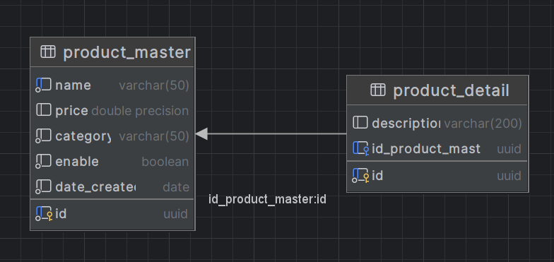

# Proyecto Spring para Registro de Productos

Este proyecto es una implementación en Spring Boot que proporciona servicios RESTful para la gestión de productos,
cumpliendo con los requisitos establecidos en la Evaluación Práctica Java. El sistema incluye operaciones de inserción,
actualización y recuperación de productos, así como la posibilidad de realizar un **"health check"** y registrar el
tiempo
de respuesta en un archivo de texto.

## Requisitos del Sistema

- Java 17
- PostgreSQL
- Spring Boot (última versión)
- Maven
- Docker

## Configuración de la Base de Datos

Se asume que ya tienes una base de datos en Docker. Puedes configurar las propiedades de conexión en el
archivo `application.properties` o `application.yml`. Asegúrate de que las migraciones se realicen correctamente.

```yaml
spring:
  datasource:
    driver-class-name: org.postgresql.Driver
    username: ${USERNAME_PROD}
    password: ${PASSWORD_PROD}
    url: jdbc:postgresql://${HOST_PROD}:${PORT_PROD}/${DATABASE_PROD} 
```
los valores reales estan en el archivo [.env](src/main/resources/.env)


## Diseño de base de Datos



## Inicialización del Proyecto

1. Construye el proyecto

### `mvn clean install`

2. Creamos la base de datos db_product

```yaml
  version: "3.9"
services:
  db-test:
    container_name: db_product
    image: postgres
    environment:
      POSTGRES_DB: ms_product
      POSTGRES_USER: omerSolutions
      POSTGRES_PASSWORD: Telomere2010
    ports:
      - "2100:2100"
    expose:
      - 2100
    command: -p 2100
```

3. Creamos la imagen docker

```dockerfile
FROM openjdk:17.0.1-jdk-slim
VOLUME /tmp
EXPOSE 3000
COPY target/java-test-1.0.0.jar java-test.jar
ENTRYPOINT ["java","-jar","java-test.jar"]
```

4. Construye la imagen Docker:


      docker build -t my-java-challenge .


5. Ejecuta el contenedor:


      docker run -p 8080:8080 my-java-challenge

## Endpoints del Servicio

Inserta un nuevo producto.

```http request
POST http://localhost:8080/api/product/master/insert 
```

```json
{
  "name": "String",
  "price": 0,
  "category": "String",
  "description": "String"
}
```

Actualiza un producto existente

```http request
PUT http://localhost:8080/api/product/master/update
```

```json
{
  "id": "uuid",
  "name": "String",
  "price": 0,
  "category": "String",
  "description": "String",
  "enable": true
}
```

Obtiene la información de un producto por su ID.

```http request
GET http://localhost:8080/api/product/master/getById/{{uuid}} 
```

Actualiza el detalle del producto por su ID.

```http request
PUT http://localhost:8080/api/product/detail/update  
```

```json
{
  "description": "String",
  "id": "uuid"
}
```

Obtiene la información del detalle del producto por su ID.

```http request
GET http://localhost:8080/api/product/detail/getById/{{uuid}}
```

## Configuración del Tiempo de Respuesta

El tiempo de respuesta de cada servicio se registra en un archivo de texto plano. Puedes encontrar los registros en la
carpeta logs del proyecto.
Health Check

El "health check" del servicio está disponible en el endpoint:

    GET /actuator/health

```json
{
  "message": "Service in operation"
}
```

## Configuración de Propiedades por Ambiente

Las propiedades específicas del ambiente se encuentran en archivos
[application-dev.yml](/src/main/resources/application-dev.yml) o
[application-prod.yml](/src/main/resources/application-prod.yml).
Asegúrate de configurar las URLs del servicio externo según el ambiente.

## Pruebas

Se han implementado pruebas unitarias y una prueba de integración utilizando TDD. Puedes ejecutar las pruebas
con el siguiente comando:

### `mvn test`

Este proyecto sigue los principios **SOLID** y utiliza buenas prácticas de codificación para garantizar un código
limpio y mantenible

